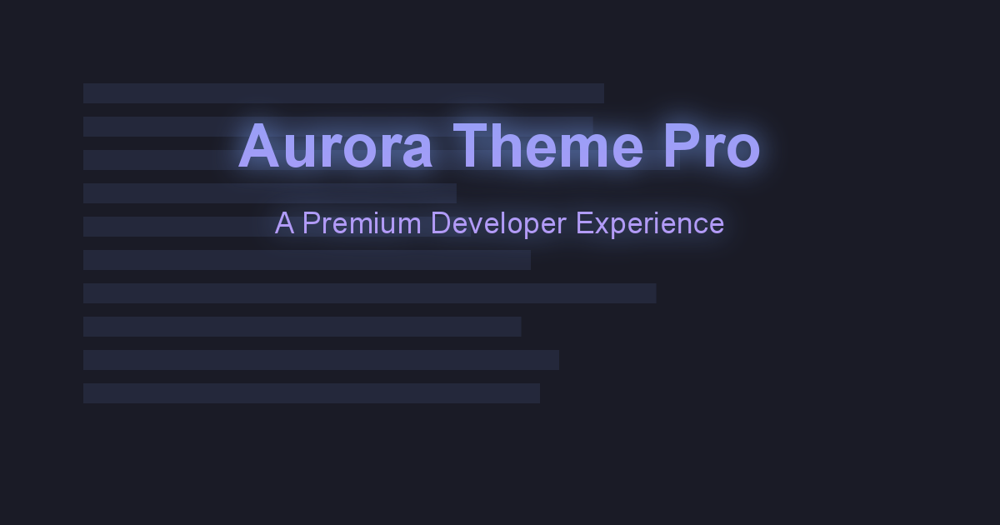

# 🌌 Aurora Theme

A premium theme collection for modern development environments, featuring carefully crafted color schemes inspired by natural phenomena and sleek design principles.

## ✨ Features

- 11 carefully crafted theme variants
- Optimized for readability and reduced eye strain
- Support for major editors (VS Code, JetBrains, Sublime Text, Atom)
- Semantic highlighting support
- Custom wallpaper pack
- Regular updates and improvements

## 🎨 Theme Variants

- **Aurora Default**: Perfect balance of contrast and vibrancy
- **Aurora Storm**: Higher contrast for bright environments
- **Aurora Night**: Minimal eye strain for late-night coding
- **Aurora Moonlight**: Soft, muted palette
- **Aurora Sunset**: Warm, cozy colors
- **Aurora Forest**: Nature-inspired earthy tones
- **Aurora Ocean**: Deep sea vibrancy
- **Aurora Sakura**: Cherry blossom inspiration
- **Aurora Ember**: Warm, fiery tones
- **Aurora Glacier**: Cool, icy precision
- **Aurora Borealis**: Nordic-inspired beauty

## 🚀 Quick Start

### VS Code
1. Install from VS Code Marketplace
2. Press `Ctrl+K Ctrl+T`
3. Select your preferred Aurora variant

### JetBrains IDEs
1. Go to Settings/Preferences → Plugins
2. Search for "Aurora Theme"
3. Install and restart IDE
4. Go to Settings/Preferences → Editor → Color Scheme
5. Select your preferred Aurora variant

### Sublime Text
1. Install via Package Control
2. Preferences → Color Scheme → Aurora Theme

### Atom/Pulsar
1. Go to Settings → Install
2. Search for "aurora-theme"
3. Install and select theme

## 📦 What's Included

- Theme files for all supported editors
- Customization options
- Wallpaper pack
- Documentation

## 🛠️ Customization

See our [Customization Guide](docs/CUSTOMIZATION.md) for detailed instructions on:
- Color customization
- Editor-specific settings
- Creating custom variants

## 🤝 Contributing

We welcome contributions! Please see our [Contributing Guide](docs/CONTRIBUTING.md) for details.

## 📄 License

This project is licensed under the MIT License - see the [LICENSE](LICENSE) file for details.

## 🌟 Support

- Website: [aurora-theme.com](https://aurora-theme.com)
- Twitter: [@aurora_theme](https://twitter.com/aurora_theme)
- Discord: [Join our community](https://discord.gg/aurora-theme)
- Email: support@aurora-theme.com

## 🙏 Credits

Created with ❤️ by the Aurora Theme team
